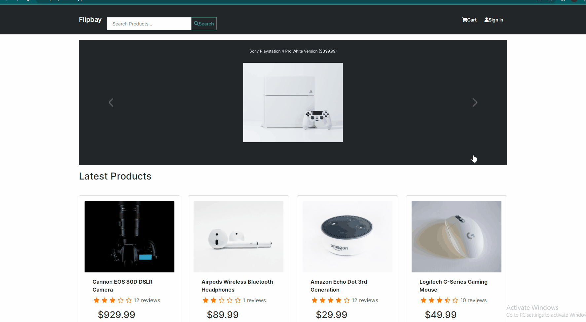

# FLIPMART 
----
> The MERN stack eCommerce platform to sell and buy products



Tech Stack
- MongoDB - database,
- Express - backend framework,
- React - frontend framework,
- Node - server
- styling - react-bootstrap

 > watch live at [https://flipmart.onrender.com](https://flipmart.onrender.com)
 
``` Sample User Logins

admin@example.com (Admin)
123456

john@example.com (Customer)
123456

jane@example.com (Customer)
123456
```

> Features

 - user login
 - user logout
 - new user registration
 - user profile update (password, email, name)
 - JWT authentication for users
 - product search
 - carousel for top rated products
 - products pagination
 - add product to cart
 - paypal payment integration
 - add shipping address
 - order summary page
 - user dashboard
 -  view all orders placed
 - local storage for shipping address, user info
 - price calculation including tax, shipping
  - responsive UI
 - #### ADMIN only
 - add products
 - view orders 
 - mark orderes as delivered 
 - set delivery status
 - change admin status
 
> How to use this repo

### 1. ENV variables

 create a .env file in root and add the following

 ```
NODE_ENV = development
PORT = 5000
MONGO_URI = <your mongodb uri>
JWT_SECRET = 'abc123'
PAYPAL_CLIENT_ID = <your paypal client id>
 ```
### 2. install dependencies
 install npm packages needed for your project for frontend & backend

```
npm install
cd frontend
npm install
```

### 3. run on local machine
 run this project on your local machine

```
# Run frontend (:3000) & backend (:5000)
npm run dev

# Run backend only
npm run server
```

### 4. Seed script for mongoDB
 populate your database with users and products

```
# Import data
npm run data:import

# Destroy data
npm run
```
### 5. Paypal credentials
 paypal credentials for payment

```
# email
sb-q475kk7727209@personal.example.com

# password
(X#i5V7f63lOj)
```

### License
---
The MIT License

Copyright (c) 2021 JMR

Permission is hereby granted,  free of charge, to any person obtaining a copy of this software and associated documentation files (the "Software"), to deal in the Software without restriction,expect not to spam this app while using live, copy, modify, merge, publish, distribute, sublicense, and/or sell copies of the Software, and to permit persons to whom the Software is furnished to do so, subject to the following conditions:

The above copyright notice and this permission notice shall be included in all copies or substantial portions of the Software.

THE SOFTWARE IS PROVIDED "AS IS", WITHOUT WARRANTY OF ANY KIND, EXPRESS OR IMPLIED, INCLUDING BUT NOT LIMITED TO THE WARRANTIES OF MERCHANTABILITY, FITNESS FOR A PARTICULAR PURPOSE AND NONINFRINGEMENT. IN NO EVENT SHALL THE AUTHORS OR COPYRIGHT HOLDERS BE LIABLE FOR ANY CLAIM, DAMAGES OR OTHER LIABILITY, WHETHER IN AN ACTION OF CONTRACT, TORT OR OTHERWISE, ARISING FROM, OUT OF OR IN CONNECTION WITH THE SOFTWARE OR THE USE OR OTHER DEALINGS IN THE SOFTWARE.

